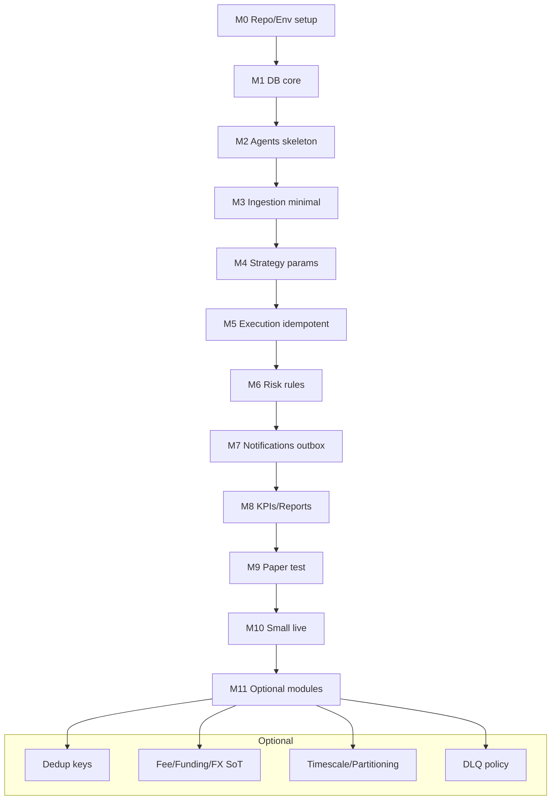

# NEXT STEPS — Mermaid Flow

```mermaid
flowchart TB
  M0["M0 Repo/Env setup"] --> M1["M1 DB core"] --> M2["M2 Agents skeleton"] --> M3["M3 Ingestion minimal"] --> M4["M4 Strategy params"] --> M5["M5 Execution idempotent"] --> M6["M6 Risk rules"] --> M7["M7 Notifications outbox"] --> M8["M8 KPIs/Reports"] --> M9["M9 Paper test"] --> M10["M10 Small live"]

  M10 --> M11["M11 Optional modules"]

  subgraph Optional
    OM1[Dedup keys]
    OM2[Fee/Funding/FX SoT]
    OM3[Timescale/Partitioning]
    OM4[DLQ policy]
  end

  M11 --> OM1
  M11 --> OM2
  M11 --> OM3
  M11 --> OM4
```

