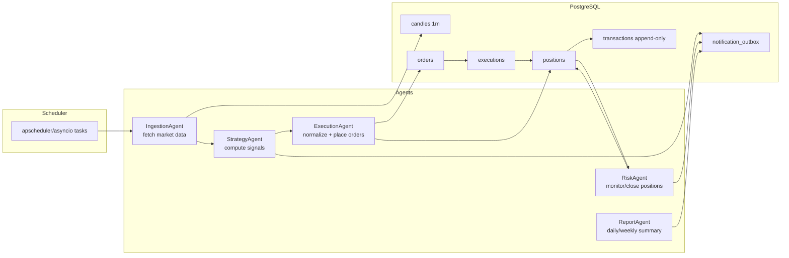
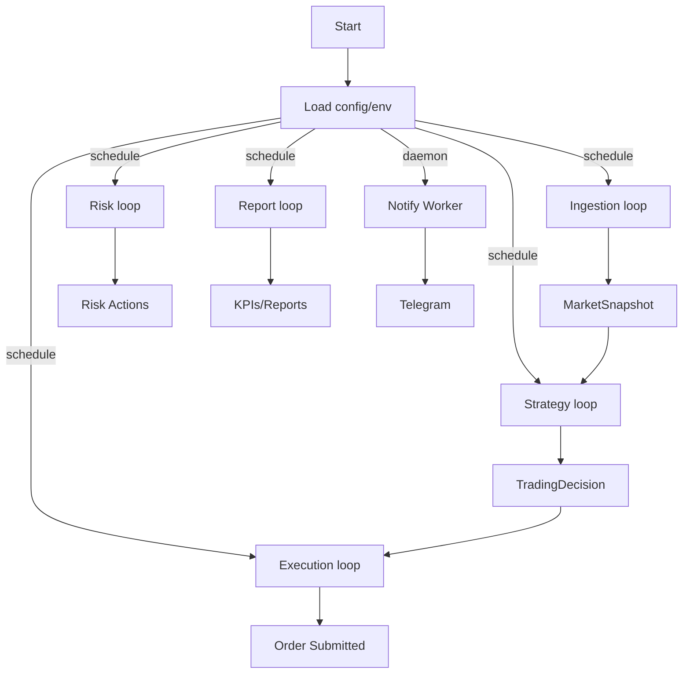
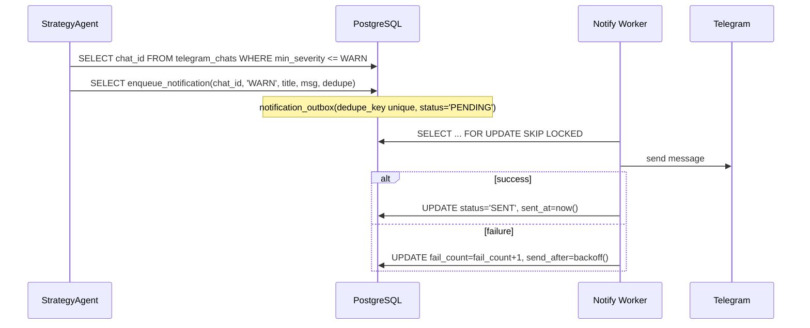
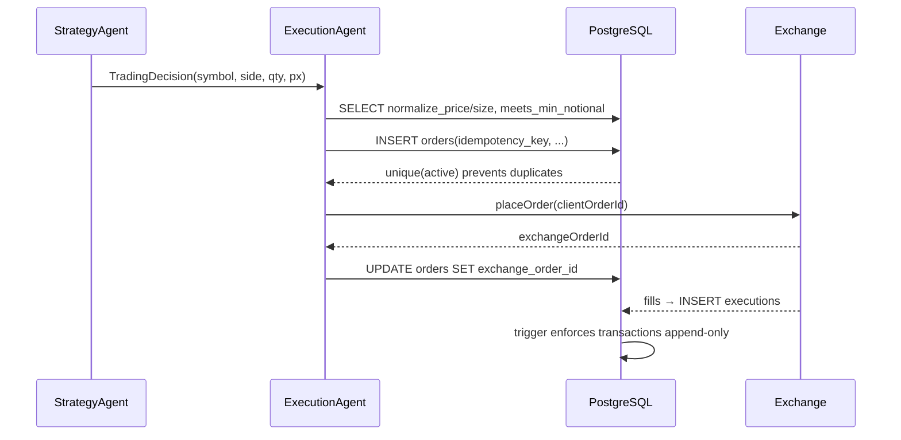

# PG Solo‑Lite Agents — Mermaid Diagrams

## Agents Pipeline

```mermaid
flowchart LR
  subgraph Scheduler
    SCHED[apscheduler/asyncio tasks]
  end

  subgraph Agents
    ING[IngestionAgent<br/>fetch market data]
    STR[StrategyAgent<br/>compute signals]
    EXE[ExecutionAgent<br/>normalize + place orders]
    RSK[RiskAgent<br/>monitor/close positions]
    RPT[ReportAgent<br/>daily/weekly summary]
  end

  subgraph DB[PostgreSQL]
    CANDLES[candles 1m]
    ORDERS[orders]
    EXECS[executions]
    POS[positions]
    TX[transactions append-only]
    OUTBOX[notification_outbox]
  end

  SCHED --> ING --> STR --> EXE --> POS --> RSK --> POS
  ING --> CANDLES
  EXE --> ORDERS --> EXECS --> POS --> TX
  STR --> OUTBOX
  RSK --> OUTBOX
  RPT --> OUTBOX
```

## Orchestration (Simplified)

```mermaid
flowchart TB
  START[Start] --> INIT[Load config/env]
  INIT -->|schedule| T1[Ingestion loop]
  INIT -->|schedule| T2[Strategy loop]
  INIT -->|schedule| T3[Execution loop]
  INIT -->|schedule| T4[Risk loop]
  INIT -->|schedule| T5[Report loop]
  INIT -->|daemon| T6[Notify Worker]

  T1 --> SNAP[MarketSnapshot]
  SNAP --> T2 --> DEC[TradingDecision]
  DEC --> T3 --> ORD[Order Submitted]
  T4 --> ACT[Risk Actions]
  T5 --> SUM[KPIs/Reports]
  T6 --> TG[Telegram]
```

## Notification Outbox — Sequence

```mermaid
sequenceDiagram
  participant STR as StrategyAgent
  participant DB as PostgreSQL
  participant WRK as Notify Worker
  participant TG as Telegram

  STR->>DB: SELECT chat_id FROM telegram_chats WHERE min_severity <= WARN
  STR->>DB: SELECT enqueue_notification(chat_id, 'WARN', title, msg, dedupe)
  Note over DB: notification_outbox(dedupe_key unique, status='PENDING')
  WRK->>DB: SELECT ... FOR UPDATE SKIP LOCKED
  WRK->>TG: send message
  alt success
    WRK->>DB: UPDATE status='SENT', sent_at=now()
  else failure
    WRK->>DB: UPDATE fail_count=fail_count+1, send_after=backoff()
  end
```

## Order Lifecycle — Sequence

```mermaid
sequenceDiagram
  participant STR as StrategyAgent
  participant EXE as ExecutionAgent
  participant DB as PostgreSQL
  participant EXC as Exchange

  STR->>EXE: TradingDecision(symbol, side, qty, px)
  EXE->>DB: SELECT normalize_price/size, meets_min_notional
  EXE->>DB: INSERT orders(idempotency_key, ...)
  DB-->>EXE: unique(active) prevents duplicates
  EXE->>EXC: placeOrder(clientOrderId)
  EXC-->>EXE: exchangeOrderId
  EXE->>DB: UPDATE orders SET exchange_order_id
  EXC-->>DB: fills → INSERT executions
  DB->>DB: trigger enforces transactions append-only
```
