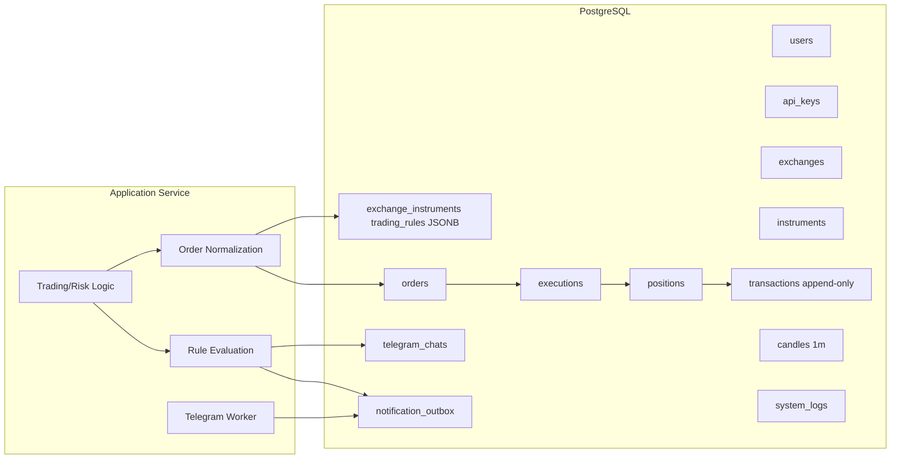
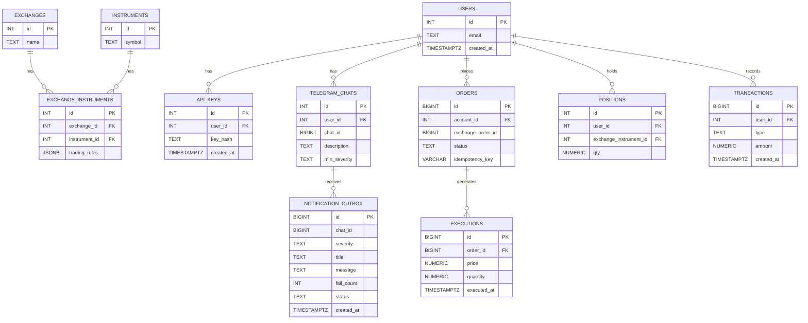

# PG Solo-Lite Diagrams

## Architecture

```mermaid
flowchart LR
  subgraph APP[Application Service]
    APPLOGIC[Trading/Risk Logic]
    NORMALIZE[Order Normalization]
    RULES[Rule Evaluation]
    WORKER[Telegram Worker]
  end

  subgraph DB[PostgreSQL]
    USERS[users]
    API_KEYS[api_keys]
    EXCHANGES[exchanges]
    INSTRUMENTS[instruments]
    EXI[exchange_instruments trading_rules JSONB]
    ORDERS[orders]
    EXECUTIONS[executions]
    POSITIONS[positions]
    TRANSACTIONS[transactions append-only]
    CANDLES[candles 1m]
    LOGS[system_logs]
    TCH[telegram_chats]
    OUTBOX[notification_outbox]
  end

  APPLOGIC --> NORMALIZE --> ORDERS --> EXECUTIONS --> POSITIONS --> TRANSACTIONS
  APPLOGIC --> RULES --> OUTBOX
  WORKER --> OUTBOX
  NORMALIZE --> EXI
  RULES --> TCH
```

## ER Diagram

```mermaid
erDiagram
  USERS ||--o{ API_KEYS : has
  USERS ||--o{ TELEGRAM_CHATS : has
  TELEGRAM_CHATS ||--o{ NOTIFICATION_OUTBOX : receives
  EXCHANGES ||--o{ EXCHANGE_INSTRUMENTS : has
  INSTRUMENTS ||--o{ EXCHANGE_INSTRUMENTS : has
  USERS ||--o{ ORDERS : places
  ORDERS ||--o{ EXECUTIONS : generates
  USERS ||--o{ POSITIONS : holds
  USERS ||--o{ TRANSACTIONS : records

  USERS {
    INT id PK
    TEXT email
    TIMESTAMPTZ created_at
  }

  API_KEYS {
    INT id PK
    INT user_id FK
    TEXT key_hash
    TIMESTAMPTZ created_at
  }

  EXCHANGES {
    INT id PK
    TEXT name
  }

  INSTRUMENTS {
    INT id PK
    TEXT symbol
  }

  EXCHANGE_INSTRUMENTS {
    INT id PK
    INT exchange_id FK
    INT instrument_id FK
    JSONB trading_rules
  }

  ORDERS {
    BIGINT id PK
    INT account_id FK
    BIGINT exchange_order_id
    TEXT status
    VARCHAR idempotency_key
  }

  EXECUTIONS {
    BIGINT id PK
    BIGINT order_id FK
    NUMERIC price
    NUMERIC quantity
    TIMESTAMPTZ executed_at
  }

  POSITIONS {
    INT id PK
    INT user_id FK
    INT exchange_instrument_id FK
    NUMERIC qty
  }

  TRANSACTIONS {
    BIGINT id PK
    INT user_id FK
    TEXT type
    NUMERIC amount
    TIMESTAMPTZ created_at
  }

  TELEGRAM_CHATS {
    INT id PK
    INT user_id FK
    BIGINT chat_id
    TEXT description
    TEXT min_severity
  }

  NOTIFICATION_OUTBOX {
    BIGINT id PK
    BIGINT chat_id
    TEXT severity
    TEXT title
    TEXT message
    INT fail_count
    TEXT status
    TIMESTAMPTZ created_at
  }
```
